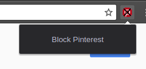

# Block Pinterest from Google Search

Tired of your google results being full of pinterest entries? They can be filtered out with search terms such as `-site:pinterest.com`, but if you just use that, pinterest.co.uk or some other tld will pop up immediately.

All this extension does, is block loads of different tlds of pinterest in your search results. Click "Block Pinterest" from the dropdown:

The extension then adds the filters to your query, all you have to do is to hit search again.

